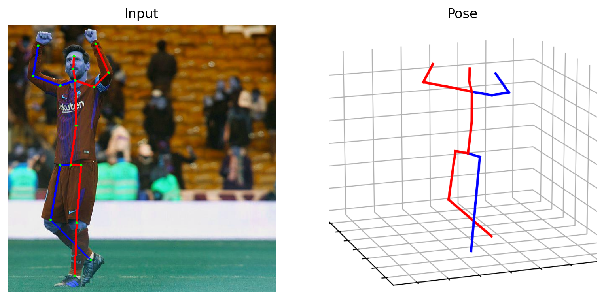

# HTNet: Human Topology Aware Network for 3D Human Pose Estimation

<p align="center"></p>

> [**HTNet: Human Topology Aware Network for 3D Human Pose Estimation**](https:),            
> Jialun Cai, Hong Liu, Runwei Ding , Wenhao Li, Jianbing Wu, Miaoju Ban  
> *In IEEE International Conference on Acoustics, Speech, and Signal Processing (ICASSP), 2023*


## Results on Human3.6M

Protocol 1 (mean per-joint position error) when 2D keypoints detected by CPN and the ground truth of 2D poses.

| Method |  Train Epochs | MPJPE (CPN) | MPJPE (GT) |
|:-------|:-------:|:-------:|:-------:|
| GraFormer |      50 |  51.8 mm | 35.2 mm |
| MGCN (w/refine)| 50 |  49.4 mm |  33.5 mm | 37.4 mm |
| HTNet          | 15 |  48.9 mm |34.0 mm|
| HTNet (w/refine) | **15** |  **47.6 mm** |**31.9 mm**|


## Get started directly
Special thanks to [MHFormer](https://github.com/Vegetebird/MHFormer), we have completed a **beginner's guide** for image-based pose estimation. 
Only two steps that poses can be generated for your own images:(1) Download pretrained models (Yolov3 and HRNet) [here](https://drive.google.com/drive/folders/1LX5zhZGlZjckgfpNroWsuu84xyyFYE5X) and put them  in the './demo/lib/checkpoint'; (2) 
Put your own images in the './demo/figure', and run:
```
python demo/vis.py
```
Then you can obtain the visualized pose in the "./demo/output", like:
<p align="center"></p>


## Quick start
To get started as quickly as possible, follow the instructions in this section. This should allow you train a model from scratch, test our pretrained models. 


### Dependencies
Make sure you have the following dependencies installed before proceeding:
- Python 3.7+ (3.10+ better)
- PyTorch >= 1.7.0
To setup the environment:
```sh
pip install -r requirement.txt
```


### Dataset setup
Please download the dataset [here](https://drive.google.com/drive/folders/1gNs5PrcaZ6gar7IiNZPNh39T7y6aPY3g) and refer to [VideoPose3D](https://github.com/facebookresearch/VideoPose3D) to set up the Human3.6M dataset ('./dataset' directory). 

```bash
${POSE_ROOT}/
|-- dataset
|   |-- data_3d_h36m.npz
|   |-- data_2d_h36m_gt.npz
|   |-- data_2d_h36m_cpn_ft_h36m_dbb.npz
```

### Evaluating our pre-trained models
The pretrained model is [here](https://drive.google.com/drive/folders/134lqqu-0I6aOYr7lRufa6fMTdqm7K9Qk), please download it and put it in the './ckpt' directory. To achieve the performance in the paper, run:
```
python main.py --reload --previous_dir "cpn" 
```

### Training your models
If you want to train your own model, run:
```
python main.py --train -n "your_model_name"
```


## Acknowledgement

Our code is extended from the following repositories. We thank the authors for releasing the codes. 
- [MHFormer](https://github.com/Vegetebird/MHFormer)
- [MGCN](https://github.com/ZhimingZo/Modulated-GCN)
- [VideoPose3D](https://github.com/facebookresearch/VideoPose3D)
- [3d-pose-baseline](https://github.com/una-dinosauria/3d-pose-baseline)
- [3d_pose_baseline_pytorch](https://github.com/weigq/3d_pose_baseline_pytorch)
- [StridedTransformer-Pose3D](https://github.com/Vegetebird/StridedTransformer-Pose3D)
## Licence

This project is licensed under the terms of the MIT license.
