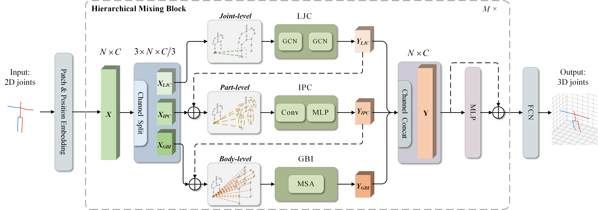

# HTFormer: Human Topology Aware Transformer for 3D Human Pose Estimation

> [**HTFormer: Human Topology Aware Transformer for 3D Human Pose Estimation**](https:),            
> Jialun Cai, Hong Liu, Wenhao Li, Jianbing Wu, Miaoju Ban, Runwei Ding        
> 

## Acknowledgement

Our code is extended from the following repositories. We thank the authors for releasing the codes. 

- [ST-GCN](https://github.com/vanoracai/Exploiting-Spatial-temporal-Relationships-for-3D-Pose-Estimation-via-Graph-Convolutional-Networks)
- [VideoPose3D](https://github.com/facebookresearch/VideoPose3D)
- [3d-pose-baseline](https://github.com/una-dinosauria/3d-pose-baseline)
- [3d_pose_baseline_pytorch](https://github.com/weigq/3d_pose_baseline_pytorch)
- [StridedTransformer-Pose3D](https://github.com/Vegetebird/StridedTransformer-Pose3D)
## Licence

This project is licensed under the terms of the MIT license.
